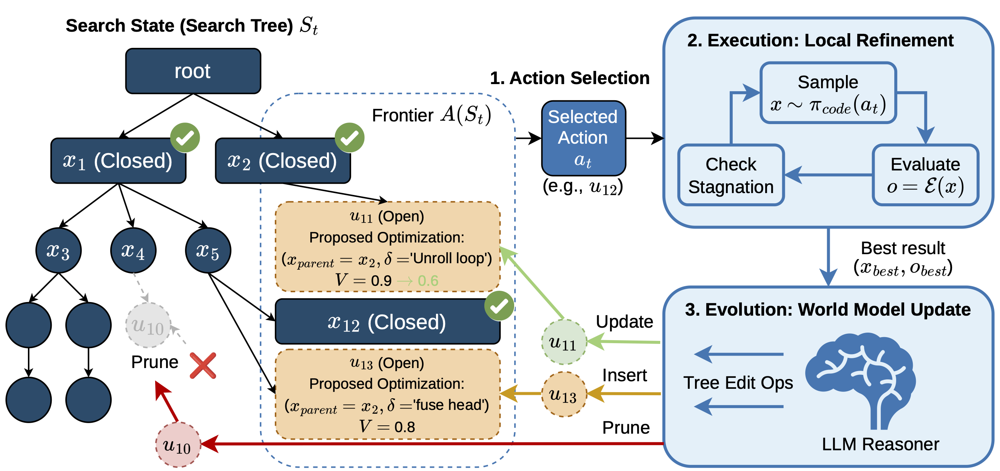
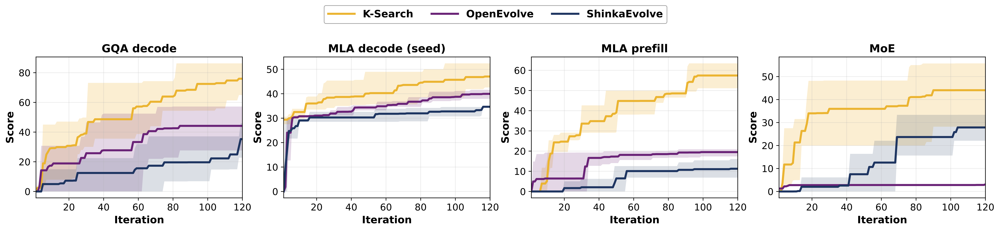

<p align="center">
  <h1 align="center">🔍 K-Search</h1>
  <p align="center">
    <b>LLM-Driven GPU Kernel Optimization with Co-Evolving Intrinsic World Model</b>
  </p>
  <p align="center">
    <i>Automatically generate, evaluate, and iteratively optimize high-performance GPU kernels using frontier LLMs guided by a co-evolving world model.</i>
  </p>
  <p align="center">
    <a href="https://arxiv.org/pdf/2602.19128v1"></a>
  </p>
</p>

<p align="center">
  
</p>

---

## Overview

**K-Search** is an automated kernel engineering system that uses large language models (GPT-5, Gemini etc.) to iteratively generate and optimize GPU kernels. Unlike one-shot code generation, K-Search maintains a **co-evolving world model** — a structured search tree that encodes hypotheses about kernel bottlenecks, design alternatives, and optimization strategies — guiding multi-round, evidence-driven search over the kernel design space efficiently.

## Features

- ⚡ **Multi-Backend Task System** — Pluggable task backends for different kernel benchmarking ecosystems:
  - [**FlashInfer-Bench**](https://bench.flashinfer.ai/) — MLA decode, GQA decode, MLA prefill, MoE kernels with full workload suites
  - [**GPUMode**](https://www.gpumode.com/home) — Competition tasks (e.g., TriMul) with leaderboard evaluation

- 📊 **W&B Integration** — Full Weights & Biases logging with per-round score tracking, generated code artifacts, and world model snapshots.

- 🔌 **Multi-Model Support** — Works with any OpenAI-compatible API endpoint:
  - OpenAI: `gpt-5.2`, `o3`
  - Google: `gemini-3-pro-preview` (via compatible endpoint)
  - Any model exposing a chat completions API

- 💾 **Solution Persistence** — All generated solutions, evaluation reports, and world model snapshots are persisted to disk for resumption and analysis.

## Architecture

```
k_search/
├── kernel_generators/
│   ├── kernel_generator.py             # Base LLM-driven kernel generator
│   ├── kernel_generator_world_model.py # World-model-aware generator (main loop)
│   ├── kernel_generator_prompts.py     # Prompt templates for generation/optimization
│   ├── world_model.py                  # World model data structures & JSON schema
│   ├── world_model_manager.py          # World model lifecycle (init/refine/select)
│   └── world_model_prompts.py          # World-model-injected prompt templates
├── tasks/
│   ├── task_base.py                    # Task protocol, Solution, EvalResult types
│   ├── flashinfer_bench_task.py        # FlashInfer-Bench task adapter
│   ├── gpu_mode_task.py                # GPUMode TriMul task adapter
│   ├── flashinfer_bench/               # FlashInfer-specific prompts
│   └── gpu_mode/                       # GPUMode evaluator, spec, utilities
│       ├── evaluator.py
│       ├── trimul/                     # Vendored TriMul problem (spec, eval, reference)
│       └── libkernelbot/              # Kernel evaluation harness
└── utils/
    ├── paths.py                        # Artifact directory management
    └── solution_db.py                  # Solution database (JSONL persistence)
```

## Quick Start

### Prerequisites

- NVIDIA GPU (H100/B200 recommended)
- An API key for an OpenAI-compatible LLM provider

### Installation

```bash
# Clone the repository
git clone https://github.com/caoshiyi/K-Search.git
cd K-Search

# Install dependencies
uv pip install openai wandb
uv pip install git+https://github.com/caoshiyi/flashinfer-bench-ksearch.git
```

We provide ready-to-use launch scripts under `scripts/` for both tasks. Before running, open the script and set the following variables at the top:

- `KSEARCH_ROOT` — Path to this repo
- `API_KEY` — Your OpenAI-compatible API key
- `WANDB_API_KEY` — Your Weights & Biases API key

### GPUMode TriMul

Edit `scripts/gpumode_trimul_wm.sh` to set the required variables, then run:

```bash
bash scripts/gpumode_trimul_wm.sh
```

Key variables you can customize (see the script header for the full list):

| Variable | Description | Default |
|----------|-------------|---------|
| `KSEARCH_ROOT` | Path to K-Search repo | — |
| `API_KEY` | OpenAI-compatible API key | — |
| `WANDB_API_KEY` | W&B API key | — |
| `MODEL_NAME` | LLM model identifier | `gpt-5.2` |
| `BASE_URL` | OpenAI-compatible API base URL | `https://us.api.openai.com/v1` |
| `LANGUAGE` | Target language (`triton`, `cuda`) | `triton` |
| `MAX_OPT_ROUNDS` | Maximum optimization rounds | `300` |

### FlashInfer-Bench

First, download the [FlashInfer Trace](https://huggingface.co/datasets/flashinfer-ai/flashinfer-trace) dataset:

```bash
# Requires git-lfs
git lfs install
git clone https://huggingface.co/datasets/flashinfer-ai/flashinfer-trace
```

Then edit `scripts/mla_decode_wm.sh` to set the required variables (including `DATASET_ROOT` pointing to the downloaded dataset), and run:

```bash
bash scripts/mla_decode_wm.sh
```

Key variables you can customize (see the script header for the full list):

| Variable | Description | Default |
|----------|-------------|---------|
| `KSEARCH_ROOT` | Path to K-Search repo | — |
| `DATASET_ROOT` | Path to downloaded `flashinfer-trace` dataset | — |
| `API_KEY` | OpenAI-compatible API key | — |
| `WANDB_API_KEY` | W&B API key | — |
| `MODEL_NAME` | LLM model identifier | `gemini-3-pro-preview` |
| `BASE_URL` | OpenAI-compatible API base URL | Gemini endpoint |
| `DEFINITION` | Target kernel definition | `mla_paged_decode_h16_ckv512_kpe64_ps1` |
| `LANGUAGE` | Target language (`triton`, `cuda`) | `cuda` |
| `MAX_OPT_ROUNDS` | Maximum optimization rounds | `20` |

## CLI Reference

| Argument | Description | Default |
|----------|-------------|---------|
| `--task-source` | Task backend (`flashinfer` or `gpumode`) | `flashinfer` |
| `--definition` | Target kernel definition name | — |
| `--model-name` | LLM model identifier | *required* |
| `--base-url` | OpenAI-compatible API base URL | OpenAI default |
| `--language` | Target language (`triton`, `cuda`) | `triton` |
| `--target-gpu` | Target GPU architecture hint | `H100` |
| `--max-opt-rounds` | Maximum optimization rounds | `5` |
| `--world-model` | Enable co-evolving world model | off |
| `--wm-stagnation-window` | Rounds without improvement before switching action | `5` |
| `--wm-max-difficulty` | Max action difficulty (1–5) to attempt | `4` |
| `--continue-from-solution` | Resume from an existing solution | — |
| `--continue-from-world-model` | Resume WM state (`auto` or path to JSON) | — |
| `--save-solutions` | Persist generated solutions to disk | off |
| `--artifacts-dir` | Base directory for all K-Search artifacts | `.ksearch` |
| `--wandb` | Enable Weights & Biases logging | off |
| `--wandb-project` | W&B project name | `flashinfer-bench` |
| `--run-name` | W&B run name | auto-generated |

## Baselines

K-Search includes adapter configurations for comparison with existing evolutionary kernel optimization systems:

| System | Directory | Description |
|--------|-----------|-------------|
| **OpenEvolve** | `baselines/openevolve/` | Google's evolutionary code optimization framework |
| **ShinkaEvolve** | `baselines/shinkaevolve/` | Evolutionary search with FlashInfer evaluator integration |

Both baselines are configured for the same kernel targets (MLA decode, GQA decode, MLA prefill, MoE) to enable direct comparison.

## Results

### FlashInfer-Bench

K-Search significantly outperforms state-of-the-art evolutionary search methods on complex kernels from [FlashInfer-Bench](https://bench.flashinfer.ai/), achieving an average **2.10×** improvement over OpenEvolve and up to **14.3×** on MoE kernels.

<p align="center">
  
</p>

### GPUMode TriMul

K-Search achieves state-of-the-art performance on the [GPUMode TriMul](https://www.gpumode.com/home) task on H100 (**1028 µs**), surpassing both prior automated and human-designed solutions. The benchmark script (`results/gpumode_trimul/bench.sh`) evaluates kernels using the [gpu-mode/reference-kernels](https://github.com/gpu-mode/reference-kernels) upstream evaluator across 7 workload configurations, reporting per-benchmark latencies and geometric means with variance across multiple runs.

Geometric mean latency across 7 benchmarks (3 runs, H100, PyTorch 2.8.0+cu128, Triton 3.4.0):

| Submission ID | Leaderboard Score | Local Score | Std |
|---------------|-------------------|-------------|-----|
| **K-Search (ours)** | — | **1.028 ms** | 0.0007 ms |
| shiyegao | 1.074 ms | 1.067 ms | 0.0013 ms |
| TTT | 1.161 ms | 1.222 ms | 0.0018 ms |
| zeyushen | 1.140 ms | 1.240 ms | 0.0057 ms |

### Generated Kernels

We provide all generated kernels (K-Search, OpenEvolve, and ShinkaEvolve) under the `results/` folder for reproducibility and comparison:

| Task | Directory |
|------|-----------|
| MLA Paged Decode | `results/mla_paged/mla_paged_decode_h16_ckv512_kpe64_ps1/` |
| MLA Paged Prefill | `results/mla_paged/mla_paged_prefill_causal_h16_ckv512_kpe64_ps1/` |
| GQA Paged Decode | `results/gqa_paged/gqa_paged_decode_h32_kv4_d128_ps1/` |
| MoE FP8 | `results/moe/moe_fp8_block_scale_ds_routing_topk8_ng8_kg4_e32_h7168_i2048/` |
| GPUMode TriMul | `results/gpumode_trimul/` |

## Citation

If you find K-Search useful in your research, please cite our paper:

```bibtex
@article{cao2026k,
  title={K-Search: LLM Kernel Generation via Co-Evolving Intrinsic World Model},
  author={Cao, Shiyi and Mao, Ziming and Gonzalez, Joseph E and Stoica, Ion},
  journal={arXiv preprint arXiv:2602.19128},
  year={2026}
}
```
