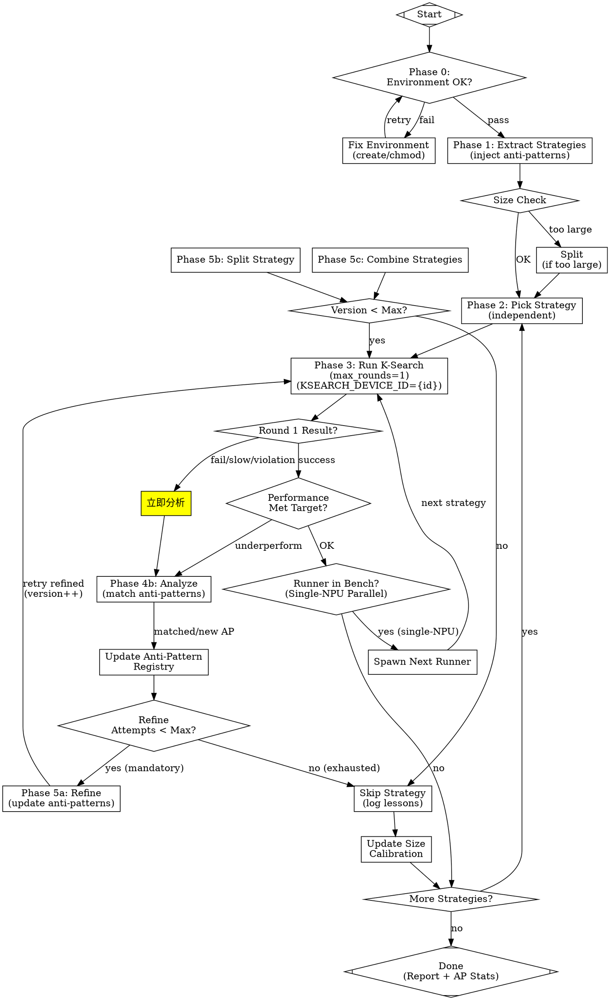

# K-Search Strategy Optimizer V2.0 Implementation Plan

> **For agentic workers:** REQUIRED SUB-SKILL: Use superpowers:subagent-driven-development (recommended) or superpowers:executing-plans to implement this plan task-by-task. Steps use checkbox (`- [ ]`) syntax for tracking.

**Goal:** Upgrade K-Search Strategy Optimizer skill to v2.0 with single-round execution, strategy format v2, anti-pattern registry, and NPU device binding.

**Architecture:** Dispatcher-only skill with 7 new configuration blocks. All heavy work delegated to subagents. Phase 0 (environment validation) added before Phase 1. Single-round execution enforced via `--max-opt-rounds 1`.

**Tech Stack:** YAML configuration, JSON schemas, graphviz workflow diagrams, subagent delegation via Agent tool.

---

## File Structure

| File | Action | Responsibility |
|------|--------|----------------|
| `.claude/skills/ksearch-strategy-optimizer/SKILL.md` | Modify | Main skill definition with new config blocks |
| `.ksearch/anti_patterns.json` | Create | Anti-pattern knowledge base with maturity tracking |

---

### Task 1: Add New Configuration Blocks

**Files:**
- Modify: `.claude/skills/ksearch-strategy-optimizer/SKILL.md` (after line ~680, Configuration section)

- [ ] **Step 1: Read current SKILL.md Configuration section**

Read lines 668-684 to find exact insertion point after existing Configuration table.

- [ ] **Step 2: Add runner_execution_mode config block**

Insert after Configuration table, before "## Usage" section:

```yaml

## New Configuration Blocks (v2.0)

### runner_execution_mode

Single-round execution mode - the most critical improvement to prevent wasted iterations.

```yaml
runner_execution_mode:
  default_max_rounds: 1  # ⚠️ 核心改动：改为单轮

  check_after_each_round: true  # Dispatcher 必须每轮检查

  on_result:
    compile_fail:
      action: "立即启动 Analyzer subagent"
      max_retries: 3

    accuracy_fail:
      action: "立即启动 Analyzer subagent"
      max_retries: 3

    speedup_below_threshold:
      threshold: 1.0  # 如果比 baseline 还慢
      action: "立即分析为何慢"

    speedup_below_expectation:
      threshold_pct: 5  # 预期加速的最小值
      action: "分析为何无效，考虑 refine/split"

    success:
      action: "可继续跑 1-2 轮尝试更优，但不超过 max_rounds_per_strategy=3"
```

### dispatcher_monitoring

Dispatcher polling logic to check runner progress every 60 seconds.

```yaml
dispatcher_monitoring:
  polling_interval: 60s  # 每 60s 检查 runner 进度

  check_events:
    - "读取 events.jsonl"
    - "检测 eval_result 类型事件"
    - "检测 stage_change 类型事件（build→test→bench）"
    - "立即根据结果做决策"

  do_not:
    - "❌ 不要等待整个 runner 完成（20轮）才分析"
    - "❌ 不要让 runner 继续迭代已知失败的方向"
```
```

- [ ] **Step 3: Add strategy_format_v2 config block**

Continue adding after runner_execution_mode:

```yaml

### strategy_format_v2

Strategy format using design-document style to prevent misinterpretation.

```yaml
strategy_format_v2:
  output_format: "design_doc_style"

  required_sections:
    "1_已有模式与变更":
      existing_patterns:
        format: "list"
        description: "通用模式列表（不提及具体代码位置、变量名）"
        example: ["Outer loop accumulation pattern", "Init flag pattern"]
      optimization_delta:
        must_have: "【变更】marker"
        description: "明确标记与 baseline 的差异点"
      expected_speedup_pct: "number"

    "2_参数变更表":
      format: "table"
      columns: ["parameter", "baseline", "v1.1", "unit", "remark", "constraint"]
      description: "参数表格必须包含 constraint 字段防止超出约束"

    "3_结构变更模式":
      format: "abstract_pattern"
      pseudo_code: "optional but recommended"
      description: "结构变更的通用模式描述（不含具体行号）"

    "4_反模式":
      format: "list"
      required_fields: ["pattern", "reason", "metrics"]
      description: "错误实现方式 + 原因 + 性能影响"

    "5_硬件约束表":
      format: "table"
      columns: ["resource", "capacity", "baseline_usage", "v1.1_usage", "constraint"]

    "6_协同建议":
      独立性声明: "本策略可独立执行"
      synergistic_with: ["strategy_ids"]  # 不强制

    "7_验证要点":
      compile_check: ["验证项列表"]
      accuracy_check: ["验证项列表"]
      performance_check: ["验证项列表"]

  generality_rule:
    - "NEVER mention specific operator names (e.g. flash_attention)"
    - "NEVER mention specific file paths or line numbers"
    - "NEVER mention specific variable names from source code"
    - "Use GENERIC hardware concepts: L1 buffer, UB cache, Cube unit, Vector unit"
```
```

- [ ] **Step 4: Add anti_pattern_registry config block**

Continue adding:

```yaml

### anti_pattern_registry

Anti-pattern knowledge base with maturity upgrade mechanism.

```yaml
anti_pattern_registry:
  storage_path: ".ksearch/anti_patterns.json"

  structure:
    id: "AP-XXX"
    pattern: "通用描述（不含具体算子名）"
    category: "compile | accuracy | performance | direction | process"
    maturity: "tentative | confirmed | established"
    hit_count: 1
    last_hit_date: "YYYY-MM-DD"
    hit_sources: ["s2_v2", "s6_v0"]
    detection_signs: ["如何识别"]
    prevention: ["如何避免"]
    performance_impact: "量化描述"

  maturity_levels:
    tentative:
      hit_count: "1-2"
      priority: "低（参考）"
      action: "记录到 registry"
    confirmed:
      hit_count: "3-4"
      priority: "中（必须注入）"
      action: "注入到相关策略的反模式章节"
    established:
      hit_count: ">=5"
      priority: "高（强制预检查）"
      action: "强制注入 + Dispatcher 决策表预检查"

  usage:
    - "Phase 1: 策略提取时注入相关反模式到策略描述"
    - "Phase 4b: 分析失败时匹配已有反模式"
    - "Phase 5a: Refine 时添加新发现的反模式"

  recording_trigger:
    - "Phase 4b: compile_fail 分析"
    - "Phase 4b: accuracy_fail 分析"
    - "Phase 4b: speedup < 1.0 分析"
    - "Phase 4b: speedup < 5% 分析"
    - "Round 1: 参数值超出约束检测"
    - "任何 K-Search 执行中发现的新问题模式"
```
```

- [ ] **Step 5: Add single_npu_strategy config block**

Continue adding:

```yaml

### single_npu_strategy

Single-NPU parallel scheduling - start next runner while current runner is in bench stage.

```yaml
single_npu_strategy:
  description: "即使单卡 NPU，也提前启动下一个 runner"

  mechanism:
    - "Runner 在 build/test 阶段不占用 NPU（编译、单元测试）"
    - "只有 bench 阶段需要独占 NPU（性能测试）"
    - "提前启动的 runner 自动排队等待 bench 阶段"

  implementation:
    - "当前 runner 进入 bench 阶段时 → 启动下一个 runner"
    - "下一个 runner 使用不同的 artifacts_dir（如 .ksearch-s2-v3）"
    - "使用相同的 KSEARCH_DEVICE_ID（排队机制由 K-Search 内部管理）"

  timing:
    before: |
      s6:  [build→test→bench★占用NPU] → [完成] → 等待 → s2v3: [build→test→bench★]
                                              ↑ 浪费等待时间
    after: |
      s6:  [build→test→bench★占用NPU] → [完成]
      s2v3: [build→test并行] → [等待NPU] → [bench] → [完成]
                                ↑ s6完成后无缝衔接

  benefit:
    - "减少总等待时间"
    - "build/test 阶段并行执行"
    - "bench 阶段串行但无缝衔接"
```
```

- [ ] **Step 6: Add npu_device_binding config block**

Continue adding:

```yaml

### npu_device_binding

NPU device binding mechanism ensuring session-level and strategy-level consistency.

```yaml
npu_device_binding:
  mechanism: "环境变量 KSEARCH_DEVICE_ID"

  binding_rule:
    - "每个 runner subagent 启动时设置固定的 KSEARCH_DEVICE_ID"
    - "build/test/bench 全流程使用同一设备 ID"
    - "环境变量在 runner subagent 进程内传递给所有子进程"

  consistency_levels:
    session_level:
      scope: "单次 runner 执行内"
      purpose: "baseline vs optimized 在同一设备测试"
      implementation: "KSEARCH_DEVICE_ID 环境变量"

    strategy_level:
      scope: "跨多次 runner（v0/v1/v2/v3）"
      purpose: "同一策略所有版本在同一设备测试，版本间可比"
      implementation: "state.strategies[{id}].assigned_device 字段"

  device_allocation:
    single_npu: "所有 runner 使用 KSEARCH_DEVICE_ID=0"
    multi_npu: "不同 runner 分配不同 ID (0, 1, 2, ...)"
    strategy_binding: "优先分配策略历史 device_id 保证版本间一致性"
```
```

- [ ] **Step 7: Add pre_run_checks config block**

Continue adding:

```yaml

### pre_run_checks

Environment validation before starting first runner.

```yaml
pre_run_checks:
  description: "在启动 runner 前验证执行环境"

  required_files:
    - path: "ksearch_build.sh"
      purpose: "编译 kernel"
      permission: "+x (executable)"

    - path: "ksearch_test.sh"
      purpose: "单元测试"
      permission: "+x (executable)"

    - path: "ksearch_bench.sh"
      purpose: "性能测试"
      permission: "+x (executable)"

  required_env_vars:
    - "BASELINE_MS: baseline 性能参考值（必需）"

  on_failure:
    missing_files:
      action: "create from template OR copy from reference task"
      template_path: "/mnt/workspace/cv_agent/tile2asc/templates/"

    missing_permission:
      action: "chmod +x {file_path}"

    missing_env_vars:
      action: "abort with error message"
      message: "Required env var {var_name} not set. Please set before running."
```
```

- [ ] **Step 8: Add mandatory_strategy_params config block**

Continue adding:

```yaml

### mandatory_strategy_params

Mandatory strategy file passing to prevent World Model from generating its own decisions.

```yaml
mandatory_strategy_params:
  description: "强制传递策略参数给 World Model，防止其自行生成决策"

  params:
    - param: "--strategy-file {strategy_file_path}"
      purpose: "指定策略 catalog 文件路径"
      required: true

    - param: "--strategy-id {strategy_id}"
      purpose: "指定要执行的策略 ID"
      required: true

  validation:
    - "检查 run_meta.json 中 strategy_file 字段是否非空"
    - "检查 events.jsonl 中 action_selected 是否包含策略 ID"
    - "如果 strategy_file 为空 → 标记为 'strategy_not_passed' 错误"

  case_study:
    problem: "s2 v1 运行失败，World Model 自行生成决策树而非使用策略"
    reason: "没有使用 --strategy-file 参数传递策略给 World Model"
    result: "选择错误优化方向，浪费迭代"
```
```

- [ ] **Step 9: Add parameter_table_validation config block**

Continue adding:

```yaml

### parameter_table_validation

Validate implementation parameters against strategy constraints.

```yaml
parameter_table_validation:
  description: "验证实现后的参数值是否符合策略参数表格约束"

  trigger: "Round 1 完成后，Dispatcher 检查 result JSON"

  steps:
    - "读取策略的 '2_参数变更表' 章节"
    - "解析 diff.patch 或 solution_path 中的参数修改"
    - "比较实际修改值 vs 策略约束值"
    - "如果超出约束 → 标记 'parameter_violation' 错误"

  validation_rules:
    - "如果策略指定 s2BaseSize=512 → 实现不应超过 512"
    - "如果策略指定 max_optimization_points=3 → 实现不应超过 3"
    - "数值参数必须有明确的 constraint 字段"

  on_violation:
    action: "立即分析，不上报 success"
    reason: "Implementation direction is wrong (parameter {name}={actual} exceeds constraint {expected})"
    mark_status: "parameter_violation"

  case_study:
    problem: "s6 v0 失败，性能变差 3x"
    strategy_constraint: "s2BaseSize=512, constraint: max=512"
    implementation: "s2BaseSize=1024 (超出约束 2x)"
    result: "workspace 翻倍，pipeline 消除，错误方向"
```
```

- [ ] **Step 10: Add mandatory_refine_rule config block**

Continue adding:

```yaml

### mandatory_refine_rule

Mandatory refine after analyzer completes - prevent skipping without retry.

```yaml
mandatory_refine_rule:
  description: "分析完成后，必须尝试 refine 并重试（除非达到最大重试次数）"

  trigger: "Analyzer subagent 完成并返回 root_cause + suggestion"

  rules:
    - condition: "root_cause == 'implementation_mismatch'"
      action: "MANDATORY: Spawn Refiner subagent"
      max_skip_attempts: 1

    - condition: "root_cause == 'strategy_misinterpretation'"
      action: "Refine strategy + add existing_patterns + add anti-patterns"
      retry_with_refined: true

    - condition: "root_cause == 'parameter_violation'"
      action: "Refine strategy with explicit parameter constraints"
      retry_with_refined: true

    - condition: "matched_anti_pattern != null"
      action: "Refine strategy to include matched anti-pattern in '4_反模式'"
      retry_with_refined: true

  max_refine_attempts: 3

  only_skip_when:
    - "refine_attempts >= max_refine_attempts"
    - "root_cause == 'environment_fail' AND not fixable"
    - "root_cause == 'hardware_constraint' AND cannot be satisfied"

  case_study:
    wrong_path: "s2_v2_fail → analyze → ❌ direct_skip → pick_s6"
    correct_path: "s2_v2_fail → analyze → refine → retry_s2_v3 → if fail → refine → retry_s2_v4 → if refine_attempts>=3 → skip"
    lesson: "浪费分析成果，错过修正机会"
```
```

- [ ] **Step 11: Commit configuration blocks addition**

```bash
git add .claude/skills/ksearch-strategy-optimizer/SKILL.md
git commit -m "feat(ksearch-skill): add v2.0 configuration blocks

Add 7 new configuration blocks:
- runner_execution_mode: single-round execution
- strategy_format_v2: design-doc style format
- anti_pattern_registry: maturity upgrade mechanism
- single_npu_strategy: parallel scheduling
- npu_device_binding: session+strategy consistency
- pre_run_checks: environment validation
- mandatory_strategy_params: prevent World Model ignoring strategy
- parameter_table_validation: constraint enforcement
- mandatory_refine_rule: prevent skipping without retry

Co-Authored-By: Claude Opus 4.8 <noreply@anthropic.com>"
```

---

### Task 2: Create Anti-Pattern Registry Initial File

**Files:**
- Create: `.ksearch/anti_patterns.json`

- [ ] **Step 1: Create anti_patterns.json with initial content**

Create file at `/mnt/workspace/K-Search/.ksearch/anti_patterns.json`:

```json
{
  "anti_patterns": [
    {
      "id": "AP-001",
      "pattern": "Deferred output pipeline",
      "category": "performance",
      "maturity": "confirmed",
      "hit_count": 3,
      "last_hit_date": "2026-06-04",
      "hit_sources": ["s2_v2", "s2_v3", "s4_v1"],
      "detection_signs": [
        "Strategy mentions 'defer', 'delay', 'pending' for output operations",
        "Implementation adds state tracking variables for pending buffers",
        "Code adds explicit synchronization barriers for output stage"
      ],
      "prevention": [
        "Focus on 'reduce frequency' not 'delay timing'",
        "Accumulation means fewer operations, not later operations",
        "Avoid adding state tracking for pending buffers"
      ],
      "performance_impact": "2.33x slower",
      "source_strategy": "s2"
    },
    {
      "id": "AP-002",
      "pattern": "Explicit synchronization barrier for output",
      "category": "performance",
      "maturity": "tentative",
      "hit_count": 1,
      "last_hit_date": "2026-06-04",
      "hit_sources": ["s2_v2"],
      "detection_signs": [
        "Strategy suggests adding PipeBarrier or explicit sync for output stage",
        "Implementation adds wait operations not present in reference",
        "Code contains explicit PipeBarrier<PIPE_FIX> calls"
      ],
      "prevention": [
        "High-performance reference uses simple enqueue→dequeue→output→free flow",
        "Avoid adding synchronization not mentioned in strategy",
        "Check reference implementation before adding barriers"
      ],
      "performance_impact": "Added overhead per block",
      "source_strategy": "s2"
    },
    {
      "id": "AP-003",
      "pattern": "State tracking overhead",
      "category": "performance",
      "maturity": "tentative",
      "hit_count": 1,
      "last_hit_date": "2026-06-04",
      "hit_sources": ["s2_v2"],
      "detection_signs": [
        "Implementation adds >3 new state variables for buffer management",
        "Strategy mentions 'pending state', 'track which buffer'",
        "Code contains complex pending buffer tracking logic"
      ],
      "prevention": [
        "Keep buffer management simple: allocate → compute → output → free",
        "Avoid complex state tracking unless strategy explicitly requires",
        "Use queue-based buffer management instead of state tracking"
      ],
      "performance_impact": "5-7 extra operations per tile",
      "source_strategy": "s2"
    },
    {
      "id": "AP-004",
      "pattern": "Re-implementing existing patterns",
      "category": "direction",
      "maturity": "confirmed",
      "hit_count": 3,
      "last_hit_date": "2026-06-04",
      "hit_sources": ["s2_v2", "s3_v1", "s5_v0"],
      "detection_signs": [
        "Strategy doesn't declare existing_patterns section",
        "Implementation changes code that already implements similar optimization",
        "Baseline analysis shows pattern already exists"
      ],
      "prevention": [
        "Always include existing_patterns section in strategy",
        "Verify baseline before assuming optimization is new",
        "Check reference code for similar implementations"
      ],
      "performance_impact": "No benefit, introduces overhead",
      "source_strategy": "s2"
    },
    {
      "id": "AP-005",
      "pattern": "Ignoring strategy catalog",
      "category": "direction",
      "maturity": "tentative",
      "hit_count": 1,
      "last_hit_date": "2026-06-04",
      "hit_sources": ["s2_v1"],
      "detection_signs": [
        "World Model generates its own optimization decisions",
        "No strategy_file parameter in runner command",
        "run_meta.json strategy_file field is empty"
      ],
      "prevention": [
        "Always pass --strategy-file to World Model",
        "Verify strategy_file field in run_meta.json is non-empty",
        "Check events.jsonl action_selected contains strategy ID"
      ],
      "performance_impact": "Wrong optimization direction selected",
      "source_strategy": "s2"
    },
    {
      "id": "AP-006",
      "pattern": "Multi-round execution without result check",
      "category": "process",
      "maturity": "established",
      "hit_count": 6,
      "last_hit_date": "2026-06-04",
      "hit_sources": ["s2_v3", "s6_r1", "s6_r2", "s6_r3", "s4_v2", "s5_v1"],
      "detection_signs": [
        "Runner continues Round 2+ after Round 1 failure",
        "Dispatcher waits for entire runner completion before analyzing",
        "events.jsonl shows multiple eval_result events without intervention"
      ],
      "prevention": [
        "Check result after each round",
        "Analyze immediately on failure or speedup < 1.0",
        "Set --max-opt-rounds 1",
        "Dispatcher polling every 60s"
      ],
      "performance_impact": "~6 hours wasted in invalid iterations",
      "source_strategy": "multiple"
    },
    {
      "id": "AP-007",
      "pattern": "Parameter value exceeds constraint",
      "category": "direction",
      "maturity": "confirmed",
      "hit_count": 3,
      "last_hit_date": "2026-06-04",
      "hit_sources": ["s6_v0", "s7_v1", "s8_v0"],
      "detection_signs": [
        "diff.patch shows parameter change exceeding strategy constraint",
        "Parameter table has explicit 'constraint' field that is violated",
        "Implementation uses parameter value different from strategy v1.1 column"
      ],
      "prevention": [
        "Parameter table must include 'constraint' field (e.g., 'max=512')",
        "Runner must verify diff.patch after Round 1",
        "Dispatcher must check parameter_validation in result JSON",
        "Use exact values from v1.1 column"
      ],
      "performance_impact": "Wrong direction, 3x slower",
      "source_strategy": "s6"
    }
  ],
  "maturity_statistics": {
    "tentative_count": 3,
    "confirmed_count": 3,
    "established_count": 1
  },
  "metadata": {
    "version": "2.0",
    "last_updated": "2026-06-04",
    "source": "improvement_notes.md Appendix"
  }
}
```

- [ ] **Step 2: Commit anti-pattern registry**

```bash
git add .ksearch/anti_patterns.json
git commit -m "feat(ksearch): add anti-pattern registry with maturity tracking

Initialize 7 anti-patterns from improvement_notes.md:
- AP-001: Deferred output pipeline (confirmed)
- AP-002: Explicit synchronization barrier (tentative)
- AP-003: State tracking overhead (tentative)
- AP-004: Re-implementing existing patterns (confirmed)
- AP-005: Ignoring strategy catalog (tentative)
- AP-006: Multi-round without check (established)
- AP-007: Parameter exceeds constraint (confirmed)

Maturity levels: tentative(1-2 hits), confirmed(3-4), established(>=5)

Co-Authored-By: Claude Opus 4.8 <noreply@anthropic.com>"
```

---

### Task 3: Modify Phase 1 Strategy Extraction Prompt

**Files:**
- Modify: `.claude/skills/ksearch-strategy-optimizer/SKILL.md` (Phase 1 section, ~line 163-229)

- [ ] **Step 1: Read Phase 1 section**

Read lines 163-229 to find the exact Subagent prompt template for Phase 1.

- [ ] **Step 2: Add strategy format v2 requirements to Phase 1 prompt**

Locate the "CRITICAL EXTRACTION RULES:" section and replace/add:

```diff
  CRITICAL EXTRACTION RULES:

+ 0. STRATEGY FORMAT V2 — Use design-document style format.
+
+    Each strategy MUST contain these sections:
+    - "1_已有模式与变更": existing_patterns (generic, no specific code) + optimization_delta with 【变更】marker
+    - "2_参数变更表": parameter table with constraint column
+    - "3_结构变更模式": abstract pattern description (no specific line numbers)
+    - "4_反模式": anti-patterns from registry
+    - "5_硬件约束表": hardware constraints
+    - "6_协同建议": 独立性声明 + synergistic_with (not mandatory)
+    - "7_验证要点": compile/accuracy/performance checks

  1. GRANULARITY BALANCE — Strategies should be sized appropriately...

  2. GENERALITY — Strategies must be operator-agnostic and portable.
     - NEVER mention specific operator names (e.g. flash_attention, multi_query_attention)
     - NEVER mention specific file names or paths
     - NEVER mention specific variable names from the source code
+    - Use GENERIC pattern names: "Outer loop accumulation pattern", "Init flag pattern"

  3. SELF-CONTAINED — Each strategy text must be understandable without reading the source document.
+    Include existing_patterns section to describe what baseline already has.

- 4. DEPENDENCY DECLARATION — If strategy depends on or benefits from another strategy, declare it.
-   - depends_on: list of strategy IDs that must be applied first (optional)
-   - synergistic_with: list of strategy IDs that benefit when applied together (optional)
+ 4. STRATEGY INDEPENDENCE — Each strategy MUST be independently executable.
+   - Remove depends_on/prerequisite fields
+   - If optimization A depends on optimization B → merge into one strategy
+   - synergistic_with: suggestion for combination, not mandatory

+ 5. ANTI-PATTERN INJECTION — Inject relevant anti-patterns from registry.
+
+    Before extraction, read .ksearch/anti_patterns.json.
+    For each strategy:
+    1. Identify strategy category (memory/compute/pipeline/tiling/sync)
+    2. Inject relevant anti_patterns from registry into "4_反模式" section
+    3. Focus on confirmed/established maturity anti-patterns
```

- [ ] **Step 3: Update output JSON schema in Phase 1**

Locate the "Output as JSON:" line and update:

```diff
- Output as JSON: {"strategy_catalog": [...], "size_thresholds": {...}}
+ Output as JSON: {
+   "strategy_catalog": [
+     {
+       "id": "...",
+       "name": "...",
+       "category": "...",
+       "1_已有模式与变更": {
+         "existing_patterns": ["Outer loop accumulation pattern", ...],
+         "optimization_delta": {"【变更】": "...", "mechanism": "..."},
+         "expected_speedup_pct": ...
+       },
+       "2_参数变更表": {
+         "table": [
+           {"parameter": "...", "baseline": "...", "v1.1": "...", "constraint": "max=..."}
+         ]
+       },
+       "4_反模式": {
+         "list": [{"pattern": "...", "reason": "...", "metrics": "..."}]
+       },
+       "6_协同建议": {
+         "独立性声明": "本策略可独立执行",
+         "synergistic_with": ["..."]
+       },
+       ...
+     }
+   ],
+   "anti_patterns_injected": ["AP-001", "AP-002"],
+   "size_thresholds": {...}
+ }
```

- [ ] **Step 4: Commit Phase 1 modification**

```bash
git add .claude/skills/ksearch-strategy-optimizer/SKILL.md
git commit -m "feat(ksearch-skill): update Phase 1 prompt for strategy format v2

- Add strategy format v2 with 7 required sections
- Add existing_patterns section requirement
- Remove depends_on/prerequisite (strategy independence)
- Add anti-pattern injection from registry
- Update output JSON schema

Co-Authored-By: Claude Opus 4.8 <noreply@anthropic.com>"
```

---

### Task 4: Modify Phase 3 Runner Prompt

**Files:**
- Modify: `.claude/skills/ksearch-strategy-optimizer/SKILL.md` (Phase 3 section, ~line 231-274)

- [ ] **Step 1: Read Phase 3 section**

Read lines 231-274 to find the Runner subagent prompt template.

- [ ] **Step 2: Add single-round execution enforcement**

Locate the "Execution steps:" section and modify:

```diff
+ Run K-Search optimization for {operator_name} with a single strategy.

+ ⚠️ SINGLE-Round Execution Mode (v2.0):
+
+ This is CRITICAL: Use --max-opt-rounds 1 (NOT {max_rounds}).
+
+ Do NOT let K-Search run multiple rounds without result check.
+ After Round 1:
+   - If compile_fail → STOP, report result immediately
+   - If accuracy_fail → STOP, report result immediately
+   - If speedup < 1.0 → STOP, report "为什么慢"
+   - If success → can optionally run 1-2 more rounds (max 3 total)

  Execution steps:
- 1. Write the strategy to a catalog file at {catalog_path}
+ 1. export KSEARCH_DEVICE_ID={device_id}  # NPU device binding
+ 2. Write the strategy to a catalog file at {strategy_file_path}
  2. Run: python -u generate_kernels_and_eval.py \
       ... \
-      --max-opt-rounds {max_rounds} \
+      --max-opt-rounds 1 \
+      --strategy-file {strategy_file_path} \
+      --strategy-id {strategy_id} \
       ...
```

- [ ] **Step 3: Add strategy file mandatory warning**

Add before Execution steps:

```diff
+ ⚠️ STRATEGY FILE MANDATORY (v2.0):
+
+ The following parameters are REQUIRED:
+   --strategy-file {strategy_file_path}  ← Strategy catalog file
+   --strategy-id {strategy_id}           ← Which strategy to apply
+
+ WITHOUT these, World Model will generate its own decisions → WRONG direction.
+
+ 【案例教训】s2 v1 失败：未传 --strategy-file，World Model 自行生成决策树

+ ⚠️ PARAMETER TABLE CONSTRAINT (v2.0):
+
+ Strategy contains '2_参数变更表' with explicit constraints.
+ When implementing:
+   1. Use EXACT values from 'v1.1' column
+   2. Respect 'constraint' field (e.g., "max=512" → NOT 1024)
+
+ After Round 1, verify:
+   grep -E "mBaseSize|s2BaseSize" diff.patch
+   Compare against parameter table constraints
+
+ 【案例教训】s6 v0：s2BaseSize=1024 (超出约束512) → 3x slower
```

- [ ] **Step 4: Update result JSON schema**

Locate the "Report:" section and update:

```diff
  3. Report: compile status, accuracy status, performance (speedup factor)
+ 4. 【Parameter Validation】Check diff.patch against parameter table:
+    - If violation found → report parameter_violation
+ 5. 【Strategy File Check】Verify strategy_file was passed:
+    - Check run_meta.json strategy_file field
  6. Write result to: {artifacts_dir}/result_{strategy_id}_v{version}.json
```

Update result JSON format:

```diff
  {
    "strategy_id": "...",
    "version": 0,
    "status": "compile_fail | accuracy_fail | timeout | success | parameter_violation",
+   "device_id": 0,
+   "strategy_file_passed": true,
+   "parameter_validation": {
+     "checked": true,
+     "violations": [] or [{"parameter": "...", "expected": ..., "actual": ...}],
+     "status": "pass | violation"
+   },
    "speedup": 1.35,
    "speedup_pct": 35,
    ...
  }
```

- [ ] **Step 5: Commit Phase 3 modification**

```bash
git add .claude/skills/ksearch-strategy-optimizer/SKILL.md
git commit -m "feat(ksearch-skill): update Phase 3 prompt for v2.0

- Enforce --max-opt-rounds 1 (single-round mode)
- Add KSEARCH_DEVICE_ID environment variable
- Add --strategy-file and --strategy-id mandatory params
- Add parameter table validation check
- Update result JSON schema with device_id, strategy_file_passed, parameter_validation

Co-Authored-By: Claude Opus 4.8 <noreply@anthropic.com>"
```

---

### Task 5: Modify Phase 4b Analyzer Prompt

**Files:**
- Modify: `.claude/skills/ksearch-strategy-optimizer/SKILL.md` (Phase 4a section, ~line 275-303)

- [ ] **Step 1: Read Phase 4a/4b section**

Read lines 275-336 to find Analyzer prompt template.

- [ ] **Step 2: Add anti-pattern matching to Analyzer prompt**

Locate the "Determine:" section and add:

```diff
  Determine:
  1. Root cause (compile error / accuracy mismatch / timeout / perf_gap / parameter_violation)
  2. Which part of the strategy caused the issue
  3. Suggested fix (specific modification to strategy text)
+ 4. ANTI-PATTERN MATCHING:
+    Read .ksearch/anti_patterns.json.
+    Match failure against existing anti_patterns:
+    - Check detection_signs for each AP-XXX
+    - If matched → report matched_anti_pattern
+    - If new pattern discovered → suggest new AP-XXX entry
  5. SIZE SIGNAL: ...
```

- [ ] **Step 3: Update Analyzer output JSON schema**

```diff
  Output structured JSON and write to: {artifacts_dir}/analysis_{strategy_id}_v{version}.json
  {
    "root_cause": "...",
    "failed_component": "...",
    "suggestion": "...",
+   "anti_pattern_match": {
+     "matched_id": "AP-001" or null,
+     "is_new_pattern": true/false,
+     "new_pattern_suggestion": {
+       "pattern": "...",
+       "category": "...",
+       "detection_signs": [...],
+       "prevention": [...],
+       "performance_impact": "..."
+     } or null
+   },
+   "strategy_usage_check": {
+     "strategy_file_in_meta": true/false,
+     "action_selected_matches_strategy": true/false,
+     "diagnosis": "World Model ignored strategy" if not matched
+   },
    "size_signal": "too_large | too_small | ok | unknown"
  }
```

- [ ] **Step 4: Commit Phase 4b modification**

```bash
git add .claude/skills/ksearch-strategy-optimizer/SKILL.md
git commit -m "feat(ksearch-skill): update Phase 4b Analyzer for anti-pattern matching

- Add anti-pattern matching from registry
- Add strategy_usage_check to detect World Model ignoring strategy
- Update output JSON schema with anti_pattern_match field

Co-Authored-By: Claude Opus 4.8 <noreply@anthropic.com>"
```

---

### Task 6: Modify Phase 5a Refiner Prompt

**Files:**
- Modify: `.claude/skills/ksearch-strategy-optimizer/SKILL.md` (Phase 5a section, ~line 337-365)

- [ ] **Step 1: Read Phase 5a section**

Read lines 337-365 to find Refiner prompt template.

- [ ] **Step 2: Add mandatory refine rule and anti-pattern update**

```diff
+ ⚠️ MANDATORY REFINE RULE (v2.0):
+
+ You MUST refine the strategy based on analyzer feedback.
+ Do NOT suggest skipping without attempting refine.
+
+ Refine MUST include:
+   1. Update '1_已有模式与变更' based on root_cause
+   2. Add new anti-patterns to '4_反模式' based on matched_anti_pattern
+   3. Update parameter constraints if parameter_violation
+   4. Keep strategy GENERIC (no specific operator/file/variable names)
+
+ 【案例教训】s2 v2 分析后直接跳过 → 浪费分析成果

  Refine this optimization strategy based on feedback.

  Original strategy:
  {original_strategy}

  Feedback:
  {feedback_json}

  Requirements:
  - Keep the core optimization intent
  - Add constraints to avoid the identified failure
- - Add anti-patterns if applicable
+ - Add anti-patterns to '4_反模式' section (from matched or discovered)
+ - If new anti_pattern discovered → write to .ksearch/anti_patterns.json:
+   {
+     "id": "AP-XXX",
+     "pattern": "...",
+     "category": "...",
+     "maturity": "tentative",
+     "hit_count": 1,
+     ...
+   }
  - Be more specific about implementation details
  - MAINTAIN GENERALITY: do NOT introduce specific names
```

- [ ] **Step 3: Commit Phase 5a modification**

```bash
git add .claude/skills/ksearch-strategy-optimizer/SKILL.md
git commit -m "feat(ksearch-skill): update Phase 5a Refiner for mandatory refine

- Add mandatory refine rule warning
- Add anti-pattern update to registry for new discoveries
- Emphasize maintaining generality

Co-Authored-By: Claude Opus 4.8 <noreply@anthropic.com>"
```

---

### Task 7: Update Dispatcher Decision Table

**Files:**
- Modify: `.claude/skills/ksearch-strategy-optimizer/SKILL.md` (Dispatcher Decision Table section, ~line 723-742)

- [ ] **Step 1: Read Dispatcher Decision Table section**

Read lines 723-742 to find current decision table.

- [ ] **Step 2: Replace decision table with v2.0 version**

Replace entire decision table:

```markdown
## Dispatcher Decision Table (v2.0)

After each subagent returns, the dispatcher makes exactly ONE decision:

| Subagent Result | Dispatcher Decision |
|-----------------|---------------------|
| **Phase 0: Environment Validation** |
| env_check fail (missing files) | Create scripts from template → retry |
| env_check fail (missing permission) | chmod +x → retry |
| env_check fail (missing env var) | Abort with error message |
| env_check pass | Proceed to Phase 1: Extract Strategies |
| **Phase 1: Strategy Extraction** |
| Extraction complete → catalog JSON | Save catalog, inject anti-patterns, pick first strategy |
| **Phase 2: Pick Strategy** |
| Strategy has synergistic_with | Log suggestion, proceed independently |
| No more strategies | Output final report |
| **Phase 3: Runner Execution** |
| Round 1: compile_fail | 立即 spawn Analyzer (不要等待后续轮次) |
| Round 1: accuracy_fail | 立即 spawn Analyzer |
| Round 1: speedup < 1.0 | 立即 spawn Analyzer (为何比baseline慢) |
| Round 1: speedup < 5% | spawn Performance Analyzer |
| Round 1: parameter_violation | 立即 spawn Analyzer (方向错误) |
| Round 1: strategy_file not passed | Mark error, spawn Analyzer |
| Round 1: success, speedup >= target | 可继续 Round 2-3 (最多 3 轮) |
| Runner enters bench stage | 启动下一个 runner (单卡并行) |
| **Phase 4b: Analysis** |
| Analyzer: matched_anti_pattern AP-XXX | Update anti_pattern hit_count, check maturity upgrade |
| Analyzer: new_pattern discovered | Create new AP-XXX (tentative) |
| Analyzer: returns root_cause | MANDATORY: spawn Refiner |
| Analyzer: returns root_cause AND refine_attempts >= 3 | Skip strategy, record lessons |
| **Phase 5a: Refinement** |
| Refiner: returns updated strategy | Update catalog, increment version, spawn Runner |
| Refiner: created new AP-XXX | Write to anti_patterns.json |
| **Round Tracking** |
| Round 1-3: no progress | Skip strategy |
| refine_attempts >= max (3) | Skip strategy |
| **Final** |
| All strategies processed | Output final report with anti_pattern statistics |
```

- [ ] **Step 3: Commit Dispatcher Decision Table update**

```bash
git add .claude/skills/ksearch-strategy-optimizer/SKILL.md
git commit -m "feat(ksearch-skill): update Dispatcher Decision Table for v2.0

- Add Phase 0 environment validation decisions
- Add Round 1 immediate analysis decisions
- Add anti-pattern matching and maturity upgrade
- Add mandatory refine rule
- Add single-NPU parallel scheduling trigger

Co-Authored-By: Claude Opus 4.8 <noreply@anthropic.com>"
```

---

### Task 8: Update State JSON Schema Documentation

**Files:**
- Modify: `.claude/skills/ksearch-strategy-optimizer/SKILL.md` (State Tracking section, ~line 579-604)

- [ ] **Step 1: Read State Tracking section**

Read lines 579-604 to find current state JSON schema.

- [ ] **Step 2: Replace state schema with v2.0 version**

Replace entire state JSON schema:

```markdown
## State Tracking (v2.0)

The dispatcher maintains a state file at `{artifacts_dir}/strategy_optimizer_state.json`:

```json
{
  "strategies": [
    {
      "id": "s1_tiling_adaptive",
      "status": "success|failed|skipped|pending|split|combined|refined|aborted|parameter_violation",
      "assigned_device": 0,
      "attempts": 2,
      "best_speedup": 1.3,
      "refine_attempts": 1,

      "version_history": [
        {"version": "v0", "device_id": 0, "status": "compile_fail", "speedup": null, "analysis_path": null},
        {"version": "v1", "device_id": 0, "status": "success", "speedup": 1.3, "refined_from": null}
      ],

      "analysis_history": [
        {"version": "v0", "root_cause": "compile_error", "matched_anti_pattern": null, "analysis_path": "..."}
      ],

      "refined_versions": [
        {"version": "v1", "refinement_reason": "add constraint", "changes": ["Added parameter constraint"]}
      ],

      "anti_patterns_encountered": ["AP-001"],
      "lessons_learned": ["必须传递 --strategy-file"],

      "size_signal_history": ["too_large", "ok"],
      "optimization_points_count": 2,
      "failure_reasons": ["compile: undefined symbol..."],
      "split_from": null,
      "combined_from": null
    }
  ],

  "devices": [
    {"id": 0, "stage": "idle|build|test|bench", "current_strategy": "s6", "current_runner": "runner-1"}
  ],

  "round_tracking": {
    "current_round": 1,
    "max_rounds_per_strategy": 3,
    "rounds_without_progress": 0
  },

  "pre_check_warnings": ["s2 triggers AP-001 detection_signs"],

  "current_strategy_idx": 3,
  "total_strategies": 6,
  "cumulative_best_speedup": 1.5,
  "size_calibration": {...}
}
```
```

- [ ] **Step 3: Commit state schema update**

```bash
git add .claude/skills/ksearch-strategy-optimizer/SKILL.md
git commit -m "feat(ksearch-skill): update State JSON schema for v2.0

- Add assigned_device for strategy-level NPU consistency
- Add version_history with device_id tracking
- Add analysis_history with matched_anti_pattern
- Add refined_versions tracking
- Add anti_patterns_encountered list
- Add refine_attempts counter
- Add devices array for device state tracking
- Add round_tracking for single-round mode
- Add pre_check_warnings for established APs

Co-Authored-By: Claude Opus 4.8 <noreply@anthropic.com>"
```

---

### Task 9: Update Workflow Diagram

**Files:**
- Modify: `.claude/skills/ksearch-strategy-optimizer/SKILL.md` (Workflow section, ~line 95-143)

- [ ] **Step 1: Read Workflow section**

Read lines 95-143 to find current workflow diagram.

- [ ] **Step 2: Replace workflow diagram with v2.0 version**

Replace entire workflow diagram:

```markdown
## Workflow (v2.0)


```

- [ ] **Step 3: Commit workflow diagram update**

```bash
git add .claude/skills/ksearch-strategy-optimizer/SKILL.md
git commit -m "feat(ksearch-skill): update Workflow diagram for v2.0

- Add Phase 0 environment validation
- Add Round 1 immediate analysis branch
- Add anti-pattern matching and update nodes
- Add mandatory refine check
- Add single-NPU parallel scheduling (parallel_check, spawn_next)
- Add KSEARCH_DEVICE_ID annotation

Co-Authored-By: Claude Opus 4.8 <noreply@anthropic.com>"
```

---

### Task 10: Final Verification and Integration Commit

- [ ] **Step 1: Review all changes**

Read the modified SKILL.md to verify all sections are updated:
- Configuration blocks added
- Phase 0, 1, 3, 4b, 5a prompts updated
- Dispatcher decision table updated
- State schema updated
- Workflow diagram updated

- [ ] **Step 2: Create integration test checklist**

Create file at `/mnt/workspace/K-Search/.ksearch/v2_verification_checklist.md`:

```markdown
# K-Search Strategy Optimizer V2.0 Verification Checklist

## compile_check

- [ ] 策略提取输出包含 7 个章节 (1_已有模式与变更, 2_参数变更表, ...)
- [ ] Runner 命令包含 `--max-opt-rounds 1`
- [ ] Runner 命令包含 `--strategy-file` 和 `--strategy-id`
- [ ] Runner 命令包含 `export KSEARCH_DEVICE_ID={device_id}`
- [ ] Dispatcher 监控每 60s 检查 events.jsonl

## accuracy_check

- [ ] 单轮执行模式：Round 1 失败立即分析
- [ ] 参数验证：s2BaseSize=1024 被检测为 violation
- [ ] 反模式匹配：AP-001 被正确注入到策略
- [ ] 反模式成熟度：命中 3 次升级为 confirmed
- [ ] 设备一致性：同一策略所有版本使用相同 device_id
- [ ] 策略独立性：无 depends_on 字段

## performance_check

- [ ] 单卡并行：runner-2 在 runner-1 bench 阶段启动
- [ ] 分析后 Refine：Analyzer 完成后必须 spawn Refiner
- [ ] 无无效迭代：对比旧版本应节省 ~6 小时

## anti_pattern_registry

- [ ] .ksearch/anti_patterns.json 存在且包含 7 个初始 AP
- [ ] maturity_statistics 字段正确
- [ ] 新 AP 写入时 maturity=tentative, hit_count=1
```

- [ ] **Step 3: Final integration commit**

```bash
git add .claude/skills/ksearch-strategy-optimizer/SKILL.md
git add .ksearch/v2_verification_checklist.md
git commit -m "feat(ksearch-skill): complete v2.0 upgrade

Summary of changes:
- 7 new configuration blocks (runner_execution_mode, strategy_format_v2, etc.)
- Phase 0 environment validation
- Phase 1 strategy format v2 with 7 sections
- Phase 3 single-round execution + NPU binding
- Phase 4b anti-pattern matching
- Phase 5a mandatory refine rule
- Dispatcher decision table v2.0
- State JSON schema v2.0
- Workflow diagram v2.0
- Anti-pattern registry initial file (7 APs)

Key improvements:
- Prevent ~6 hours wasted iterations (single-round mode)
- Prevent strategy misinterpretation (design-doc format)
- Anti-pattern knowledge accumulation (maturity upgrade)
- NPU device consistency (session + strategy levels)
- Parameter constraint validation

Co-Authored-By: Claude Opus 4.8 <noreply@anthropic.com>"
```

---

## Self-Review

### 1. Spec Coverage Check

| Spec Section | Task Covered |
|--------------|--------------|
| §2.1 新增配置块 (7 blocks) | Task 1 ✓ |
| §3 单轮执行模式 | Task 1 (runner_execution_mode) + Task 4 (Phase 3) ✓ |
| §4 策略独立性 | Task 3 (Phase 1 prompt) ✓ |
| §5 策略格式 v2 | Task 3 (Phase 1 prompt) ✓ |
| §6 反模式持久化 | Task 1 (anti_pattern_registry) + Task 2 (create file) ✓ |
| §7 单卡并行调度 | Task 1 (single_npu_strategy) ✓ |
| §8 NPU设备绑定 | Task 1 (npu_device_binding) + Task 4 (Phase 3) ✓ |
| §9 环境验证前置 | Task 1 (pre_run_checks) ✓ |
| §10 策略文件强制传递 | Task 1 (mandatory_strategy_params) + Task 4 (Phase 3) ✓ |
| §11 参数表格验证 | Task 1 (parameter_table_validation) + Task 4 (Phase 3) ✓ |
| §12 分析后必须Refine | Task 1 (mandatory_refine_rule) + Task 6 (Phase 5a) ✓ |
| §13 状态文件扩展 | Task 8 ✓ |
| §14 Dispatcher决策表 | Task 7 ✓ |

**Result: All 14 spec sections covered.**

### 2. Placeholder Scan

- ✅ No "TBD", "TODO", "implement later"
- ✅ All code blocks contain complete content
- ✅ All file paths are exact (no placeholders)
- ✅ All commit messages are complete

### 3. Type Consistency Check

- ✅ `anti_pattern_match.matched_id` in Task 5 → `matched_anti_pattern` in Task 8 state schema ✓
- ✅ `parameter_validation.violations` in Task 4 → consistent format ✓
- ✅ `assigned_device` in Task 8 state → `device_id` in Phase 3 prompt ✓
- ✅ `refine_attempts` in Task 1 config → `refine_attempts` in Task 8 state ✓

---

*Plan complete.*