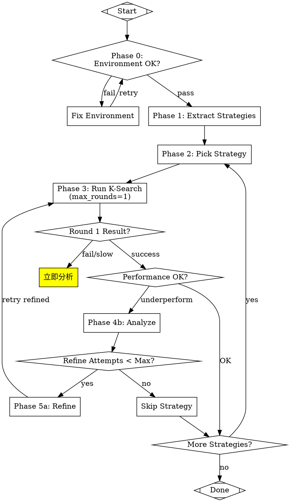

# K-Search Strategy Optimizer Skill V2.0 设计文档

> 版本: 2.0
> 日期: 2026-06-04
> 状态: Draft for Review
> 来源: improvement_notes.md 问题分析

## 1. 概述

### 1.1 问题背景

基于 `/mnt/workspace/K-Search/.ksearch/improvement_notes.md` 中的实战教训，当前 K-Search Strategy Optimizer Skill 存在以下核心问题：

| 问题 ID | 问题描述 | 影响 | 优先级 |
|---------|---------|------|--------|
| #9 | 单轮执行缺失，Runner 允许 20 轮无效迭代 | 浪费 ~6 小时 | 最高 |
| #10 | 前置依赖未强制检查 | s2 v3 在 s6 失败后仍执行 | 最高 |
| #11 | 参数表格未传递明确数值 | s6 实现 s2BaseSize=1024（应为512） | 最高 |
| #1 | 策略格式缺乏结构 | s2 误解为 "deferred Fixpipe" | 高 |
| #2 | 分析后未 Refine | 直接跳过策略而非重试 refined 版本 | 高 |
| #8 | 反模式未持久化 | 相同错误重复出现 | 高 |
| #3 | 单卡并行调度缺失 | 未提前启动下一个 runner | 中 |
| #4 | 环境验证未前置 | s2 v0 构建脚本不存在 | 中 |
| #5 | 策略文件未强制传递 | World Model 自行生成决策树 | 中 |
| #7 | 状态文件结构简陋 | 缺乏分析历史、refined_versions | 低 |

### 1.2 设计目标

1. **单轮执行 + 立即分析**：每轮结束后立即检查结果，避免无效迭代
2. **策略独立性**：移除依赖机制，每个策略独立可执行
3. **策略格式改进**：采用设计文档形式，避免误解
4. **反模式知识库**：持久化 + 成熟度升级机制
5. **NPU 设备一致性**：会话级别 + 策略级别两层保证
6. **参数约束验证**：防止参数值超出策略约束

### 1.3 改动范围

本次改动为**全面改动**（方案 C），包含全部 11 个改进点。

---

## 2. 架构变更

### 2.1 新增配置块

在 SKILL.md 的 Configuration 部分之后，新增以下配置块：

```yaml
## New Configuration Blocks (v2.0)

runner_execution_mode:        # 单轮执行模式
  default_max_rounds: 1
  check_after_each_round: true

strategy_format_v2:           # 策略格式改进
  output_format: "design_doc_style"
  required_sections: [...]

anti_pattern_registry:        # 反模式持久化
  storage_path: ".ksearch/anti_patterns.json"
  maturity_levels: "tentative|confirmed|established"

single_npu_strategy:          # 单卡并行调度
  mechanism: "build/test 不占用 NPU"

npu_device_binding:           # NPU 设备绑定
  mechanism: "KSEARCH_DEVICE_ID 环境变量"
  consistency_levels: "session|strategy"

pre_run_checks:               # 环境验证前置
  required_files: [ksearch_build.sh, ksearch_test.sh, ksearch_bench.sh]

mandatory_strategy_params:    # 策略文件强制传递
  params: [--strategy-file, --strategy-id]

parameter_table_validation:   # 参数表格验证
  trigger: "Round 1 完成后"

mandatory_refine_rule:        # 分析后必须 Refine
  max_refine_attempts: 3
```

### 2.2 Workflow 图修订

新增 Phase 0（环境验证）和单轮检查节点：



---

## 3. 单轮执行模式

### 3.1 配置定义

```yaml
runner_execution_mode:
  default_max_rounds: 1  # 核心改动：改为单轮

  check_after_each_round: true  # Dispatcher 必须每轮检查

  on_result:
    compile_fail:
      action: "立即启动 Analyzer subagent"
      max_retries: 3

    accuracy_fail:
      action: "立即启动 Analyzer subagent"
      max_retries: 3

    speedup_below_threshold:
      threshold: 1.0  # 如果比 baseline 还慢
      action: "立即分析为何慢"

    speedup_below_expectation:
      threshold_pct: 5  # 预期加速的最小值
      action: "分析为何无效，考虑 refine/split"

    success:
      action: "可继续跑 1-2 轮尝试更优，但不超过 max_rounds_per_strategy=3"
```

### 3.2 Dispatcher 监控逻辑

```yaml
dispatcher_monitoring:
  polling_interval: 60s  # 每 60s 检查 runner 进度

  check_events:
    - "读取 events.jsonl"
    - "检测 eval_result 类型事件"
    - "检测 stage_change 类型事件（build→test→bench）"
    - "立即根据结果做决策"

  do_not:
    - "不要等待整个 runner 完成（20轮）才分析"
    - "不要让 runner 继续迭代已知失败的方向"
```

### 3.3 Runner 命令模板修订

```diff
- --max-opt-rounds {max_rounds}
+ --max-opt-rounds 1  # 强制单轮
```

---

## 4. 策略独立性（移除依赖机制）

### 4.1 设计决策

每个策略独立可执行，不依赖其他策略的成功状态。

### 4.2 策略提取规则修订

```yaml
strategy_extraction_rules:
  independence_requirement:
    - "每个策略必须独立可执行，不依赖其他策略的执行结果"
    - "如果优化 A 依赖优化 B 的参数或结构 → 合并成一个策略"
    - "如果依赖部分无法合并 → 在策略描述中明确'需要手动配置参数 X'"
    - "移除 depends_on/prerequisite 字段"
    - "synergistic_with 保留（表示建议组合，但不强制）"
```

### 4.3 策略格式调整

```diff
  "6_协同建议":
-   "depends_on": ["s6_adaptive_macro_block"],
+   "独立性声明": "本策略可独立执行，参数 nL1Blocks=2 为推荐值",
    "synergistic_with": ["s4_l1_multi_buffer_pipeline"]
```

---

## 5. 策略格式 V2（设计文档形式）

### 5.1 格式规范

```yaml
strategy_format_v2:
  output_format: "design_doc_style"

  required_sections:
    - "1_已有模式与变更":
      - existing_patterns:  # 通用模式列表（不提及具体代码）
        format: "list"
        example: ["Outer loop accumulation pattern", "Init flag pattern"]
      - optimization_delta:
        must_have: "【变更】marker"
      - expected_speedup_pct

    - "2_参数变更表":
      format: "table"
      columns: ["parameter", "baseline", "v1.1", "unit", "remark", "constraint"]

    - "3_结构变更模式":
      format: "abstract_pattern"
      pseudo_code: "optional but recommended"

    - "4_反模式":
      format: "list"
      required_fields: ["pattern", "reason", "metrics"]

    - "5_硬件约束表":
      format: "table"
      columns: ["resource", "capacity", "baseline_usage", "v1.1_usage", "constraint"]

    - "6_协同建议":
      - 独立性声明
      - synergistic_with

    - "7_验证要点":
      compile_check: [...]
      accuracy_check: [...]
      performance_check: [...]
```

### 5.2 通用模式词汇表

| 具体代码位置 | 通用模式描述 |
|-------------|-------------|
| `kTiles loop` | `Outer dimension accumulation pattern` |
| `cmatrixInitVal=(ki==0)` | `Init flag pattern (first iteration reset)` |
| `Fixpipe` | `Output writeback operation` |
| `queL0C_.AllocTensor` | `Buffer allocation for accumulation` |

---

## 6. 反模式持久化 + 成熟度升级

### 6.1 反模式结构

```yaml
anti_pattern_structure:
  - id: "AP-XXX"
    pattern: "通用描述"
    category: "compile | accuracy | performance | direction | process"

    # 成熟度相关字段
    maturity: "tentative | confirmed | established"
    hit_count: 1
    last_hit_date: "2026-06-04"
    hit_sources: ["s2_v2", "s6_v0"]

    detection_signs: [...]
    prevention: [...]
    performance_impact: "量化描述"
```

### 6.2 成熟度等级

| 等级 | 命中次数 | 含义 | 处理优先级 |
|------|---------|------|-----------|
| `tentative` | 1-2 次 | 初步发现 | 低（参考） |
| `confirmed` | 3-4 次 | 确认模式 | 中（必须注入） |
| `established` | ≥5 次 | 确立模式 | 高（强制预检查） |

### 6.3 记录触发时机

```yaml
anti_pattern_recording:
  trigger_on:
    - "Phase 4b: compile_fail 分析"
    - "Phase 4b: accuracy_fail 分析"
    - "Phase 4b: speedup < 1.0 分析"
    - "Phase 4b: speedup < 5% 分析"
    - "Round 1: 参数值超出约束检测"
    - "任何 K-Search 执行中发现的新问题模式"
```

### 6.4 存储位置

`.ksearch/anti_patterns.json`

---

## 7. 单卡 NPU 并行调度

### 7.1 机制说明

```yaml
single_npu_strategy:
  mechanism:
    - "Runner 在 build/test 阶段不占用 NPU"
    - "只有 bench 阶段需要独占 NPU"
    - "提前启动的 runner 自动排队等待 bench"

  implementation:
    - "当前 runner 进入 bench 阶段时 → 启动下一个 runner"
    - "下一个 runner 使用不同的 artifacts_dir"
    - "使用相同的 KSEARCH_DEVICE_ID（自动排队）"
```

### 7.2 时间线

```
s6:  [build→test→bench★占用NPU] → [完成]
s2v3: [build→test并行] → [等待NPU] → [bench] → [完成]
```

### 7.3 max_parallel_runners 计算

```yaml
max_parallel_runners_formula:
  single_npu: "2"  # 单卡时也可以有 2 个 runner 排队
```

---

## 8. NPU 设备绑定与一致性

### 8.1 设备绑定机制

```yaml
npu_device_binding:
  mechanism: "环境变量 KSEARCH_DEVICE_ID"

  binding_rule:
    - "每个 runner subagent 启动时设置固定的 KSEARCH_DEVICE_ID"
    - "build/test/bench 全流程使用同一设备 ID"
```

### 8.2 两层一致性

| 层级 | 范围 | 目的 | 实现时机 |
|------|------|------|---------|
| **会话级别** | 单次 runner 执行内 | baseline vs optimized 在同一设备 | runner subagent 内部 |
| **策略级别** | 跨多次 runner | v0/v1/v2/v3 在同一设备 | Dispatcher 设备分配 |

### 8.3 state JSON 扩展

```json
{
  "strategies": [
    {
      "id": "s2_l0c_accumulation",
      "assigned_device": 0,
      "version_history": [
        {"version": "v0", "device_id": 0, "speedup": null},
        {"version": "v1", "device_id": 0, "speedup": null}
      ]
    }
  ],
  "devices": [
    {"id": 0, "stage": "bench", "current_strategy": "s6"}
  ]
}
```

---

## 9. 环境验证前置

### 9.1 配置定义

```yaml
pre_run_checks:
  required_files:
    - path: "ksearch_build.sh"
      permission: "+x"
    - path: "ksearch_test.sh"
      permission: "+x"
    - path: "ksearch_bench.sh"
      permission: "+x"

  required_env_vars:
    - "BASELINE_MS"

  on_failure:
    missing_files:
      action: "create from template OR copy from reference"
    missing_permission:
      action: "chmod +x"
```

### 9.2 Phase 0 流程

```yaml
Phase_0_environment_validation:
  trigger: "Dispatcher 在启动第一个 runner 前"

  steps:
    - "检查 required_files"
    - "检查执行权限"
    - "检查 required_env_vars"
    - "如果 pass → Phase 1"
    - "如果 fail → 执行 on_failure action"
```

---

## 10. 策略文件强制传递

### 10.1 配置定义

```yaml
mandatory_strategy_params:
  params:
    - "--strategy-file {strategy_file_path}"
      required: true
    - "--strategy-id {strategy_id}"
      required: true

  validation:
    - "检查 run_meta.json 中 strategy_file 字段非空"
    - "检查 events.jsonl 中 action_selected 包含策略 ID"
```

### 10.2 Runner 命令修订

```diff
+ --strategy-file {strategy_file_path} \
+ --strategy-id {strategy_id} \
```

---

## 11. 参数表格强制验证

### 11.1 配置定义

```yaml
parameter_table_validation:
  trigger: "Round 1 完成后"

  steps:
    - "读取策略 '2_参数变更表'"
    - "解析 diff.patch 中的参数修改"
    - "比较实际值 vs 约束值"
    - "如果超出 → 标记 'parameter_violation'"
```

### 11.2 参数表格格式

```json
{
  "parameter": "s2BaseSize",
  "baseline": "128",
  "v1.1": "512",
  "constraint": "max=512, NOT 1024"
}
```

### 11.3 result JSON 扩展

```json
{
  "parameter_validation": {
    "checked": true,
    "violations": [{"parameter": "s2BaseSize", "expected": 512, "actual": 1024}],
    "status": "violation"
  }
}
```

---

## 12. 分析后必须 Refine

### 12.1 配置定义

```yaml
mandatory_refine_rule:
  trigger: "Analyzer 完成并返回 root_cause + suggestion"

  rules:
    - condition: "root_cause == 'implementation_mismatch'"
      action: "MANDATORY: Spawn Refiner"
      max_skip_attempts: 1

    - condition: "root_cause == 'strategy_misinterpretation'"
      action: "Refine + add existing_patterns + add anti-patterns"

  max_refine_attempts: 3

  only_skip_when:
    - "refine_attempts >= max_refine_attempts"
    - "root_cause == 'environment_fail' AND not fixable"
```

### 12.2 正确决策路径

```
s2_v2_fail → analyze → refine → retry_refined_s2_v3
  ↓
if s2_v3_still_fail → analyze → refine → retry_s2_v4
  ↓
if refine_attempts >= 3 → skip → pick_s6
```

---

## 13. 状态文件结构扩展

### 13.1 扩展 schema

```yaml
state_file_schema_v2:
  strategies:
    - id: "string"
      status: "..."
      assigned_device: "number"

      version_history:
        - version: "v0|v1|..."
          device_id: "number"
          status: "..."
          speedup: "number"
          analysis_path: "string"
          refined_from: "string"

      analysis_history:
        - version: "v2"
          root_cause: "..."
          matched_anti_pattern: "AP-XXX"

      refined_versions:
        - version: "v3"
          refinement_reason: "..."
          changes: [...]

      anti_patterns_encountered: ["AP-001", "AP-002"]
      lessons_learned: [...]
      refine_attempts: "number"

  devices:
    - id: 0
      stage: "idle|build|test|bench"
      current_strategy: "string"

  round_tracking:
    current_round: 1
    max_rounds_per_strategy: 3

  pre_check_warnings: [...]
```

---

## 14. Dispatcher 决策表修订

| Subagent Result | Dispatcher Decision |
|-----------------|---------------------|
| Phase 0: env_check fail | Fix environment → retry |
| Phase 0: env_check pass | Proceed to Phase 1 |
| Runner: Round 1 compile_fail | 立即 spawn Analyzer |
| Runner: Round 1 accuracy_fail | 立即 spawn Analyzer |
| Runner: Round 1 speedup < 1.0 | 立即 spawn Analyzer（为何慢） |
| Runner: Round 1 speedup < 5% | spawn Performance Analyzer |
| Runner: parameter_violation | 立即 spawn Analyzer |
| Runner: Round 1 success, speedup >= target | 可继续 Round 2-3（最多 3 轮） |
| Analyzer: returns root_cause | MANDATORY: spawn Refiner |
| Analyzer: returns root_cause AND refine_attempts >= 3 | Skip strategy |
| Refiner: returns updated strategy | Update catalog, spawn Runner (version++) |
| Runner 进入 bench 阶段 | 启动下一个 runner（单卡并行） |

---

## 15. 实施计划

### 15.1 文件改动清单

| 文件 | 改动类型 | 改动内容 |
|------|---------|---------|
| `.claude/skills/ksearch-strategy-optimizer/SKILL.md` | 修改 | 新增配置块 + 修改 prompt 模板 + 修改 Workflow 图 |
| `.ksearch/anti_patterns.json` | 新增 | 反模式知识库初始文件 |
| `strategy_optimizer_state.json` schema | 修改 | 扩展字段定义 |

### 15.2 改动行数估算

- SKILL.md: ~250 行新增/修改
- anti_patterns.json: ~100 行初始内容
- 总计: ~350 行

---

## 16. 验证要点

### 16.1 compile_check

- [ ] 策略提取输出符合 v2 格式（包含 7 个章节）
- [ ] Runner 命令包含 `--max-opt-rounds 1`
- [ ] Runner 命令包含 `--strategy-file` 和 `--strategy-id`
- [ ] Dispatcher 监控每 60s 检查 events.jsonl

### 16.2 accuracy_check

- [ ] 单轮执行模式：Round 1 失败立即分析，不继续 Round 2
- [ ] 参数验证：s2BaseSize=1024 被检测为 violation
- [ ] 反模式匹配：AP-001 被正确注入到策略
- [ ] 设备一致性：同一策略所有版本使用相同 device_id

### 16.3 performance_check

- [ ] 单卡并行：runner-2 在 runner-1 bench 阶段启动
- [ ] 时间节省：无无效迭代（对比旧版本 ~6 小时浪费）
- [ ] 反模式成熟度：多次命中自动升级

---

## 附录 A：反模式初始列表

从 improvement_notes.md 提取的已知反模式：

| ID | Pattern | Category | Source |
|----|---------|----------|--------|
| AP-001 | Deferred output pipeline | performance | s2_v2 |
| AP-002 | Explicit synchronization barrier | performance | s2_v2 |
| AP-003 | State tracking overhead | performance | s2_v2 |
| AP-004 | Re-implementing existing patterns | direction | s2_v2 |
| AP-005 | Ignoring strategy catalog | direction | s2_v1 |
| AP-006 | Multi-round without check | process | s2_v3, s6 |
| AP-007 | Parameter exceeds constraint | direction | s6_v0 |

---

## 附录 B：通用模式词汇表

| 具体代码 | 通用描述 |
|---------|---------|
| `kTiles loop` | Outer dimension accumulation pattern |
| `cmatrixInitVal` | Init flag pattern |
| `Fixpipe` | Output writeback operation |
| `queL0C_` | Buffer queue for accumulation |
| `TilingData` | Tiling parameter structure |
| `CopyIn/CopyOut` | Data transfer operation |

---

*文档结束*